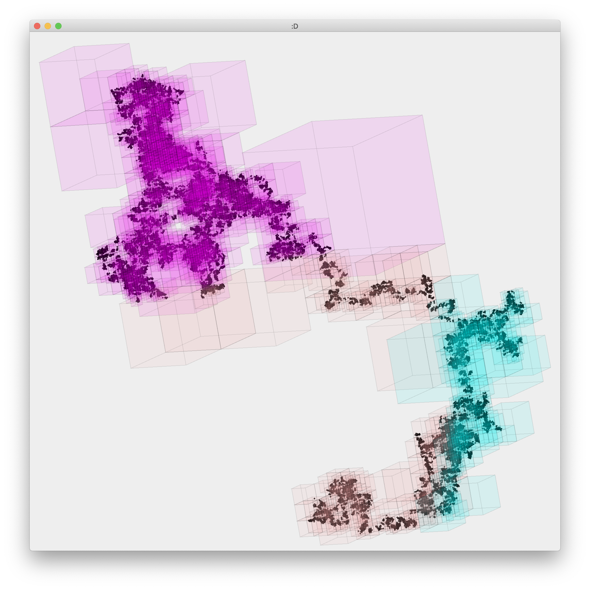

# spatial

trying out some spatial data structures with a quick-and-dirty 3D engine...

## OctTree

Key Commands:
|key|action|
|-|-|
|arrows|adjust x/y rotation|
|a|toggle axes|
|c|clear|
|f|only render octants with points|
|o|toggle octant rendering|
|p|toggle point rendering|
|r|re-initialize random walk|
